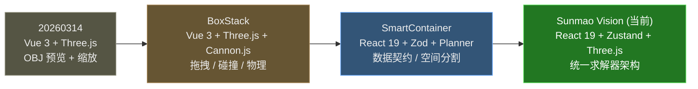
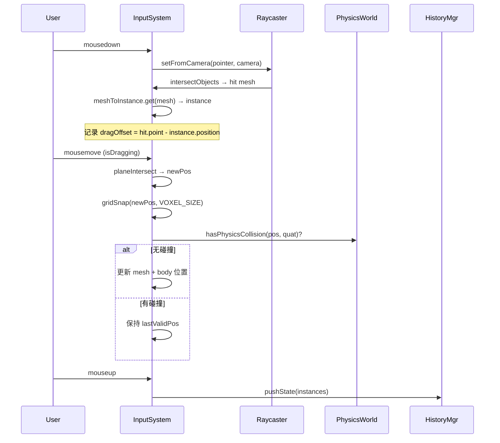
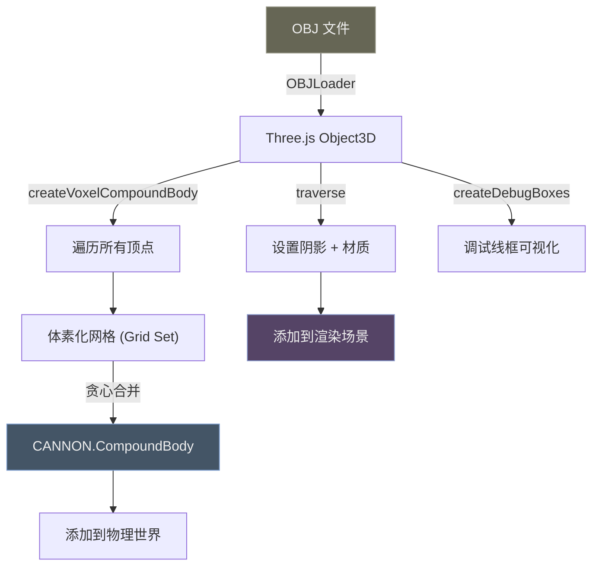

# 🏗️ Sunmao Vision — 遗留架构模式迁移指南

> **目标读者**：AI Agent / 开发者
> **生成时间**：2026-04-02
> **源码范围**：`legacy_code/源码文件/BoxStack/`、`legacy_code/SmartContainer/`、`legacy_code/20260314/`
> **迁移目标**：`apps/web/` — React 19 + Zustand + Three.js (react-three-fiber ready)

---

## 📋 目录

1. [项目演化全景图](#1-项目演化全景图)
2. [模式 1：拖拽交互系统](#2-模式-1拖拽交互系统-drag--drop)
3. [模式 2：状态管理与撤销/重做](#3-模式-2状态管理与撤销重做)
4. [模式 3：碰撞检测系统](#4-模式-3碰撞检测系统)
5. [模式 4：装箱/排布算法](#5-模式-4装箱排布算法)
6. [模式 5：模型加载与体素化物理体](#6-模式-5模型加载与体素化物理体)
7. [模式 6：Gizmo 可视化系统](#7-模式-6gizmo-可视化系统)
8. [模式 7：场景序列化 I/O](#8-模式-7场景序列化-io)
9. [范式转换速查表](#9-范式转换速查表)
10. [迁移优先级矩阵](#10-迁移优先级矩阵)

---

## 1. 项目演化全景图



| 维度 | 20260314 (Vue) | BoxStack (Vue) | SmartContainer (React) | **当前项目** |
|------|---------------|----------------|----------------------|-------------|
| 框架 | Vue 3 SFC | Vue 3 Composition API | React 19 + Hooks | React 19 + Zustand |
| 3D 引擎 | Three.js 命令式 | Three.js + Cannon.js | Three.js (R3F ready) | Three.js 命令式 |
| 状态 | `reactive` / `ref` | `ref` + 命令式操作 | `useState` + API calls | **Zustand store** |
| 物理 | 无 | Cannon.js 全集成 | 无 (仅算法) | `@sunmao/solver` |
| 数据契约 | 无 | 松散约定 | **Zod Schema** | **Zod `@sunmao/contracts`** |
| 交互 | 点击 BBox 棱边 | Raycaster + 自定义 Gizmo | 表单驱动 | Raycaster + 面板联动 |

---

## 2. 模式 1：拖拽交互系统 (Drag & Drop)

### 2.1 旧代码精髓提取

> [!IMPORTANT]
> **核心源码**：[inputSystem.js](file:///F:/Project%20file/sunmao-vision/legacy_code/源码文件/BoxStack/src/inputSystem.js) + [main.js L721-L900](file:///F:/Project%20file/sunmao-vision/legacy_code/源码文件/BoxStack/src/main.js#L721-L900)

#### 核心流程（命令式）



#### 关键算法：网格吸附 (Grid Snapping)

```javascript
// 原始实现 (inputSystem.js L98-L125)
// 核心思想：基于体素尺寸，将坐标对齐到网格
function snapToGrid(position, voxelSize, boundingBox, referencePoint) {
  const halfSize = {
    x: (boundingBox.max.x - boundingBox.min.x) / 2,
    y: (boundingBox.max.y - boundingBox.min.y) / 2,
    z: (boundingBox.max.z - boundingBox.min.z) / 2,
  };

  // 计算边缘相对于参考点的偏移
  const edgeOffset = {
    x: (referencePoint.x + halfSize.x) % voxelSize,
    y: (referencePoint.y + halfSize.y) % voxelSize,
    z: (referencePoint.z + halfSize.z) % voxelSize,
  };

  // 对齐到最近的网格线
  return {
    x: Math.round((position.x - edgeOffset.x) / voxelSize) * voxelSize + edgeOffset.x,
    y: Math.round((position.y - edgeOffset.y) / voxelSize) * voxelSize + edgeOffset.y,
    z: Math.round((position.z - edgeOffset.z) / voxelSize) * voxelSize + edgeOffset.z,
  };
}
```

#### 关键算法：拖拽平面投射

```javascript
// 原始实现 (inputSystem.js L130-L170)
// 使用 XZ 平面（Y 固定）进行拖拽位置计算
const dragPlane = new THREE.Plane(new THREE.Vector3(0, 1, 0), -dragStartY);
const intersectPoint = new THREE.Vector3();
raycaster.ray.intersectPlane(dragPlane, intersectPoint);

// 应用 dragOffset，使拖拽点保持在鼠标下方
newPosition.x = intersectPoint.x - dragOffset.x;
newPosition.z = intersectPoint.z - dragOffset.z;
// Y 轴锁定（在地面拖拽模式下）
newPosition.y = dragStartY;
```

### 2.2 范式差异分析

| 旧代码 (Vue 命令式) | 新项目 (React 声明式) |
|---|---|
| 直接 `instance.modelGroup.position.set(x,y,z)` | 更新 Zustand state → 触发 React 重渲染 |
| `meshToInstance` Map 双向绑定 | `useProjectStore` 中 cargoId → 3D Node 映射 |
| `mousemove` 事件中直接修改 body.position | **应该**: Action → State Change → 渲染同步 |
| 碰撞检测后回退到 `lastValidPos` | 通过 solver re-solve 保障一致性 |

### 2.3 迁移方案

```typescript
// ── 推荐：创建 hooks/useDragInteraction.ts ────────────────────

import { useCallback, useRef } from 'react';
import * as THREE from 'three';
import { useProjectStore } from '../stores/useProjectStore';

interface DragState {
  isDragging: boolean;
  cargoInstanceId: string | null;
  dragOffset: THREE.Vector3;
  dragPlane: THREE.Plane;
  lastValidPosition: THREE.Vector3;
}

export function useDragInteraction(
  cameraRef: React.RefObject<THREE.Camera>,
  sceneRef: React.RefObject<THREE.Scene>
) {
  const dragState = useRef<DragState>({
    isDragging: false,
    cargoInstanceId: null,
    dragOffset: new THREE.Vector3(),
    dragPlane: new THREE.Plane(new THREE.Vector3(0, 1, 0), 0),
    lastValidPosition: new THREE.Vector3(),
  });

  const raycaster = useRef(new THREE.Raycaster());

  const onPointerDown = useCallback((event: PointerEvent) => {
    // 1. Raycast 找到被点击的 cargo mesh
    // 2. 通过 mesh.userData.cargoInstanceId 找到对应的状态
    // 3. 记录 dragOffset 和初始 dragPlane
    // 4. 标记 isDragging = true
  }, []);

  const onPointerMove = useCallback((event: PointerEvent) => {
    if (!dragState.current.isDragging) return;
    // 1. 射线与 dragPlane 求交 → rawPos
    // 2. snapToGrid(rawPos, GRID_SIZE) → snappedPos
    // 3. 碰撞检测（可选：调用 solver 或自定义 SAT）
    // 4. 若无碰撞：setSelection + 更新 3D mesh 位置（临时视觉反馈）
    //    记录 lastValidPosition
    // 5. 若有碰撞：回退到 lastValidPosition
  }, []);

  const onPointerUp = useCallback(() => {
    if (!dragState.current.isDragging) return;
    // 1. 提交最终位置到 Zustand store → 触发 re-solve
    // 2. 重置 dragState
    // 3. 推送历史记录快照
  }, []);

  return { onPointerDown, onPointerMove, onPointerUp };
}
```

> [!TIP]
> **关键迁移点**：拖拽过程中的**视觉反馈**应直接操作 Three.js mesh（命令式），只有在 mouseup **提交时**才写入 Zustand。这种"乐观更新"模式可以避免每帧触发 React 重渲染。

---

## 3. 模式 2：状态管理与撤销/重做

### 3.1 旧代码精髓提取

> [!IMPORTANT]
> **核心源码**：[historySystem.js](file:///F:/Project%20file/sunmao-vision/legacy_code/源码文件/BoxStack/src/historySystem.js)

#### 核心数据结构

```javascript
// historySystem.js 核心设计
function createHistoryManager() {
  const undoStack = ref([]);   // Array<Snapshot>
  const redoStack = ref([]);   // Array<Snapshot>

  // Snapshot = Map<instanceId, { position: Vec3, quaternion: Quat }>

  function pushState(instances) {
    const snapshot = new Map();
    instances.forEach(inst => {
      snapshot.set(inst, {
        position: inst.physicsBody.position.clone(),
        quaternion: inst.physicsBody.quaternion.clone(),
      });
    });
    undoStack.value.push(snapshot);
    redoStack.value = []; // 新操作清空 redo 栈
  }

  function undo(instances) {
    if (!undoStack.value.length) return;
    // 1. 保存当前状态到 redoStack
    // 2. 弹出 undoStack 顶部
    // 3. 恢复所有 instance 的 position + quaternion
    // 4. 同步 Three.js mesh 位置
  }

  return { pushState, undo, redo, canUndo, canRedo };
}
```

#### 设计要点

- **快照粒度**：每次操作记录**所有实例**的完整位置+旋转状态
- **数据独立**：快照使用 `clone()` 深拷贝，避免引用泄漏
- **栈限制**：无上限（建议迁移时加最大深度限制，如 50 步）
- **触发时机**：mouseup（拖拽结束）、旋转完成、删除操作

### 3.2 当前项目状态管理分析

当前项目使用 **Zustand** 作为唯一状态源：

```
useProjectStore
├── project: SolveRequest        ← 数据模型（货物+集装箱）
├── solveResult: SolveResult     ← 求解器输出（摆放结果）
├── selectedIds: Set<string>     ← UI 选中状态
├── isSolving: boolean           ← 防重入锁
├── forkInstanceAndReSolve()     ← 实例分裂 + 重新求解
├── updateCargoAndReSolve()      ← 模板更新 + 重新求解
└── updateContainerAndReSolve()  ← 集装箱更新 + 重新求解
```

### 3.3 迁移方案：Zustand 中间件式撤销/重做

```typescript
// ── 推荐：stores/useHistoryStore.ts ────────────────────────────

import { create } from 'zustand';
import type { SolveRequest, SolveResult } from '@sunmao/contracts';

interface HistorySnapshot {
  project: SolveRequest;
  solveResult: SolveResult | null;
  timestamp: number;
}

interface HistoryStore {
  undoStack: HistorySnapshot[];
  redoStack: HistorySnapshot[];
  maxDepth: number;

  /** 在执行任何修改操作前调用，保存当前快照 */
  pushSnapshot: (current: {
    project: SolveRequest;
    solveResult: SolveResult | null;
  }) => void;

  /** 撤销：弹出 undoStack 顶部，恢复到 projectStore */
  undo: () => HistorySnapshot | null;

  /** 重做：弹出 redoStack 顶部 */
  redo: () => HistorySnapshot | null;

  canUndo: () => boolean;
  canRedo: () => boolean;
}

export const useHistoryStore = create<HistoryStore>((set, get) => ({
  undoStack: [],
  redoStack: [],
  maxDepth: 50,

  pushSnapshot: (current) => {
    set((state) => ({
      undoStack: [
        ...state.undoStack.slice(-(state.maxDepth - 1)),
        {
          project: structuredClone(current.project),
          solveResult: current.solveResult
            ? structuredClone(current.solveResult)
            : null,
          timestamp: Date.now(),
        },
      ],
      redoStack: [], // 新操作清空 redo
    }));
  },

  undo: () => {
    const { undoStack } = get();
    if (!undoStack.length) return null;
    const snapshot = undoStack[undoStack.length - 1];
    set((state) => ({
      undoStack: state.undoStack.slice(0, -1),
      redoStack: [...state.redoStack, snapshot],
    }));
    return snapshot;
  },

  redo: () => {
    const { redoStack } = get();
    if (!redoStack.length) return null;
    const snapshot = redoStack[redoStack.length - 1];
    set((state) => ({
      redoStack: state.redoStack.slice(0, -1),
      undoStack: [...state.undoStack, snapshot],
    }));
    return snapshot;
  },

  canUndo: () => get().undoStack.length > 0,
  canRedo: () => get().redoStack.length > 0,
}));
```

> [!TIP]
> **集成方式**：在 `useProjectStore` 的每个 `*AndReSolve` action 开头调用 `useHistoryStore.getState().pushSnapshot({ project, solveResult })`，这样每次变更前自动保存快照。

---

## 4. 模式 3：碰撞检测系统

### 4.1 旧代码精髓提取

> [!IMPORTANT]
> **核心源码**：[collisionSystem.js](file:///F:/Project%20file/sunmao-vision/legacy_code/源码文件/BoxStack/src/collisionSystem.js)

#### SAT 算法核心

```javascript
// collisionSystem.js — 分离轴定理 (Separating Axis Theorem)
// 用于精确检测两个旋转后的 OBB (Oriented Bounding Box) 是否相交

function boxesIntersect(bodyA, shapeA, bodyB, shapeB) {
  // 1. 获取两个 Box 的半尺寸
  const halfA = shapeA.halfExtents;
  const halfB = shapeB.halfExtents;

  // 2. 获取世界坐标系下的旋转矩阵（3x3）
  const rotA = bodyA.quaternion;  // → 提取 3 个轴向量
  const rotB = bodyB.quaternion;

  // 3. 计算中心距离向量 T = centerB - centerA
  const T = new CANNON.Vec3();
  bodyB.position.vsub(bodyA.position, T);

  // 4. 测试 15 条分离轴（3+3+9）
  //    - A 的 3 个局部轴
  //    - B 的 3 个局部轴
  //    - A×B 交叉积的 9 个轴
  for (const axis of separatingAxes) {
    const projA = projectOnAxis(halfA, rotA, axis);
    const projB = projectOnAxis(halfB, rotB, axis);
    const dist = Math.abs(T.dot(axis));
    if (dist > projA + projB) return false; // 找到分离轴 → 不相交
  }

  return true; // 所有轴都重叠 → 相交
}
```

#### 碰撞检测上下文

```javascript
// main.js L721-L791：拖拽时的碰撞检测循环
function hasPhysicsCollision(targetBody, allBodies) {
  for (const otherBody of allBodies) {
    if (otherBody === targetBody) continue;
    // 逐对检测所有 shape 组合
    for (const shapeA of targetBody.shapes) {
      for (const shapeB of otherBody.shapes) {
        if (boxesIntersect(targetBody, shapeA, otherBody, shapeB)) {
          return true;
        }
      }
    }
  }
  return false;
}
```

### 4.2 迁移方案

当前项目已有 `@sunmao/solver` 处理静态装箱碰撞。**若需实时拖拽碰撞检测**，建议：

```typescript
// ── 推荐：utils/obbCollision.ts ────────────────────────────────

import * as THREE from 'three';

/**
 * 检测两个 OBB 是否相交（SAT 算法）
 * 适配 Three.js 的 Matrix4/Quaternion 体系
 */
export function testOBBIntersection(
  boxA: { center: THREE.Vector3; halfExtents: THREE.Vector3; rotation: THREE.Quaternion },
  boxB: { center: THREE.Vector3; halfExtents: THREE.Vector3; rotation: THREE.Quaternion }
): boolean {
  // 提取 A 的 3 个局部轴（从 Quaternion 导出旋转矩阵）
  const matA = new THREE.Matrix3().setFromMatrix4(
    new THREE.Matrix4().makeRotationFromQuaternion(boxA.rotation)
  );
  const axesA = [
    new THREE.Vector3(matA.elements[0], matA.elements[1], matA.elements[2]),
    new THREE.Vector3(matA.elements[3], matA.elements[4], matA.elements[5]),
    new THREE.Vector3(matA.elements[6], matA.elements[7], matA.elements[8]),
  ];

  // 提取 B 的 3 个局部轴
  const matB = new THREE.Matrix3().setFromMatrix4(
    new THREE.Matrix4().makeRotationFromQuaternion(boxB.rotation)
  );
  const axesB = [
    new THREE.Vector3(matB.elements[0], matB.elements[1], matB.elements[2]),
    new THREE.Vector3(matB.elements[3], matB.elements[4], matB.elements[5]),
    new THREE.Vector3(matB.elements[6], matB.elements[7], matB.elements[8]),
  ];

  const T = new THREE.Vector3().subVectors(boxB.center, boxA.center);

  // 测试 15 条分离轴
  const testAxes = [
    ...axesA,
    ...axesB,
    // 交叉积（跳过近零值防退化）
    ...axesA.flatMap(a => axesB.map(b => new THREE.Vector3().crossVectors(a, b)))
  ];

  const EPSILON = 1e-6;
  for (const axis of testAxes) {
    if (axis.lengthSq() < EPSILON) continue;
    axis.normalize();

    const projA = axesA.reduce((sum, a, i) =>
      sum + Math.abs(a.dot(axis)) * boxA.halfExtents.getComponent(i), 0);
    const projB = axesB.reduce((sum, b, i) =>
      sum + Math.abs(b.dot(axis)) * boxB.halfExtents.getComponent(i), 0);
    const dist = Math.abs(T.dot(axis));

    if (dist > projA + projB + EPSILON) return false;
  }

  return true;
}
```

> [!NOTE]
> 当前 `@sunmao/solver` 已内置碰撞检测。此独立 OBB 检测函数主要用于**拖拽时的实时反馈**，在 `onPointerMove` 中以 60fps 调用，无需触发完整的 re-solve。

---

## 5. 模式 4：装箱/排布算法

### 5.1 算法对比

````carousel
### BoxStack — 贪心网格搜索

```
源码：autoStack.js
策略：按体积降序排列 → 中心向外螺旋搜索
```

```javascript
// autoStack.js L60-L130 (简化)
function findPlacementPosition(box, container, existingBoxes) {
  const gridStep = VOXEL_SIZE;
  // 从中心开始，螺旋式向外搜索
  for (let radius = 0; radius < maxRadius; radius += gridStep) {
    for (const candidate of spiralPositions(radius, gridStep)) {
      if (isInsideContainer(box, candidate, container)
       && !hasCollision(box, candidate, existingBoxes)) {
        return candidate;  // 第一个合法位置
      }
    }
  }
  return null; // 放不下
}
```

**优点**：简单直观，易于调试
**缺点**：O(n²) 复杂度，无空间回收

<!-- slide -->

### SmartContainer — FreeSpace 空间分割

```
源码：planner-core/src/index.ts
策略：维护可用空间列表 → 分割/合并
```

```typescript
// planner-core L80-L200 (简化)
interface FreeSpace {
  origin: { x: number; y: number; z: number };
  dimensions: { length: number; width: number; height: number };
}

function buildLoadPlan(assets: ModelAsset[], container: ContainerSpec) {
  let freeSpaces: FreeSpace[] = [
    { origin: { x: 0, y: 0, z: 0 }, dimensions: container }
  ];

  for (const asset of sortByVolume(assets)) {
    const bestFit = findBestFitSpace(asset, freeSpaces);
    if (bestFit) {
      placeAsset(asset, bestFit);
      freeSpaces = splitFreeSpace(freeSpaces, bestFit, asset);
    } else {
      stageAsset(asset); // 放不下 → 待装区
    }
  }
}
```

**优点**：O(n·m) 复杂度，支持空间回收
**缺点**：实现复杂，碎片化问题

<!-- slide -->

### 当前项目 — @sunmao/solver

```
源码：packages/solver/
策略：统一求解器接口，支持多策略切换
```

```typescript
// 当前项目的 solver 调用模式
import { solve } from '@sunmao/solver';

const result: SolveResult = solve({
  containers: [...],
  cargoList: [...],
});

// result.containers[0].placements → 每个货物的最终位置
// result.unplacedItems → 未能放入的货物
```

**架构优势**：
- Zod 契约保障类型安全
- 支持多集装箱分配
- Fork 机制支持单实例定制

````

### 5.2 迁移建议

> [!TIP]
> 当前 `@sunmao/solver` 已经覆盖了算法需求。如果需要增强，建议将 SmartContainer 的 **FreeSpace 分割策略** 移植为 solver 的可选策略插件，而非替换现有逻辑。

---

## 6. 模式 5：模型加载与体素化物理体

### 6.1 旧代码精髓提取

> [!IMPORTANT]
> **核心源码**：[modelManager.js](file:///F:/Project%20file/sunmao-vision/legacy_code/源码文件/BoxStack/src/modelManager.js) + [voxelBody.js](file:///F:/Project%20file/sunmao-vision/legacy_code/源码文件/BoxStack/src/voxelBody.js)

#### 模型加载流水线



#### 体素化贪心合并算法

```javascript
// voxelBody.js — 核心算法思想
// 1. 提取所有 mesh 顶点 → 世界坐标
// 2. 量化为体素网格坐标 (gx, gy, gz)
// 3. 贪心合并相邻体素为更大的 Box：
//    - 先沿 X 扩展
//    - 再沿 Y 扩展（确保整行 X 都兼容）
//    - 最后沿 Z 扩展（确保整面 X*Y 都兼容）
// 4. 每个合并后的 Box → CANNON.Box shape
// 5. 所有 shapes → CANNON.CompoundBody
```

### 6.2 迁移方案

当前项目使用包络体（BoundingBox）而非体素化物理体。若需升级到精确碰撞：

```typescript
// ── 推荐：utils/voxelCollider.ts ────────────────────────────────

import * as THREE from 'three';

interface VoxelBox {
  center: THREE.Vector3;
  halfExtents: THREE.Vector3;
}

/**
 * 将 Object3D 体素化为合并后的盒子列表
 * 用于精确碰撞检测（无需 Cannon.js 依赖）
 */
export function voxelizeToBoxes(
  object3D: THREE.Object3D,
  voxelSize: number = 0.15
): VoxelBox[] {
  // 1. 收集所有顶点
  const vertices: THREE.Vector3[] = [];
  object3D.updateWorldMatrix(true, true);
  object3D.traverse((child) => {
    if (!(child instanceof THREE.Mesh) || !child.geometry) return;
    const positionAttr = child.geometry.getAttribute('position');
    const vertex = new THREE.Vector3();
    for (let i = 0; i < positionAttr.count; i++) {
      vertex.fromBufferAttribute(positionAttr, i);
      vertex.applyMatrix4(child.matrixWorld);
      vertices.push(vertex.clone());
    }
  });

  if (!vertices.length) return [];

  // 2. 计算边界 & 体素化
  const min = new THREE.Vector3(Infinity, Infinity, Infinity);
  const max = new THREE.Vector3(-Infinity, -Infinity, -Infinity);
  for (const v of vertices) { min.min(v); max.max(v); }

  const gridSet = new Set<string>();
  for (const v of vertices) {
    const gx = Math.floor((v.x - min.x) / voxelSize);
    const gy = Math.floor((v.y - min.y) / voxelSize);
    const gz = Math.floor((v.z - min.z) / voxelSize);
    gridSet.add(`${gx},${gy},${gz}`);
  }

  // 3. 贪心合并（同 voxelBody.js 的 XYZ 扩展策略）
  const visited = new Set<string>();
  const boxes: VoxelBox[] = [];

  for (const key of gridSet) {
    if (visited.has(key)) continue;
    const [gx, gy, gz] = key.split(',').map(Number);

    // X 扩展 → Y 扩展 → Z 扩展（省略，逻辑同旧代码）
    // ... (见 voxelBody.js L49-L98)

    // boxes.push({ center, halfExtents });
  }

  return boxes;
}
```

---

## 7. 模式 6：Gizmo 可视化系统

### 7.1 旧代码精髓提取

> [!IMPORTANT]
> **核心源码**：[gizmos.js](file:///F:/Project%20file/sunmao-vision/legacy_code/源码文件/BoxStack/src/gizmos.js) (463 行)

#### 可视化组件清单

| 组件 | 功能 | 实现方式 |
|------|------|---------|
| 旋转箭头 | 6 方向旋转指示器 | `THREE.Mesh` (自定义弯曲箭头几何体) |
| 平移箭头 | XYZ 轴平移控制 | `THREE.ArrowHelper` |
| 投影线 | 物体到地面/墙面的投影 | `THREE.Line` (虚线材质) |
| 包围盒棱边 | BBox 交互式边缘 | `THREE.EdgesGeometry` + 色彩编码 |
| 轴颜色编码 | X=红, Y=绿, Z=蓝 | `AXIS_META` 常量映射 |

#### 20260314 版本的 BBox 交互（更精细）

```javascript
// App.vue L479-L543 — BBox 棱边点击检测
// 1. 将所有 BBox 棱边投影到 2D 屏幕坐标
// 2. 计算鼠标点到每条 2D 线段的距离
// 3. 取距离最近且 < threshold(12px) 的棱边
// 4. 通过 axis 颜色识别是 X/Y/Z 方向
// → 弹出 inline editor，输入目标尺寸
```

### 7.2 迁移方案

```typescript
// ── 推荐：viewport/GizmoOverlay.tsx ────────────────────────────

// 利用 Three.js 原生 TransformControls（操作 Gizmo）
// + 自定义投影线/辅助线（信息 Gizmo）

import { TransformControls } from 'three/examples/jsm/controls/TransformControls.js';

// 在 Viewport3D 中集成：
function setupGizmo(camera: THREE.Camera, renderer: THREE.WebGLRenderer) {
  const gizmo = new TransformControls(camera, renderer.domElement);
  gizmo.setMode('translate'); // 'translate' | 'rotate' | 'scale'
  gizmo.setTranslationSnap(GRID_SIZE); // ← 复用旧代码的网格吸附
  gizmo.setRotationSnap(THREE.MathUtils.degToRad(90));

  gizmo.addEventListener('objectChange', () => {
    // 实时更新投影线
    updateProjectionLines(gizmo.object);
  });

  gizmo.addEventListener('mouseUp', () => {
    // 拖拽完成 → 提交到 Zustand
    const position = gizmo.object.position;
    useProjectStore.getState().commitDragPosition(cargoId, position);
  });

  return gizmo;
}

// 投影线（从旧代码 gizmos.js 提取）
function createProjectionLines(object: THREE.Object3D): THREE.Group {
  const group = new THREE.Group();
  const dashedMaterial = new THREE.LineDashedMaterial({
    color: 0x888888,
    dashSize: 0.05,
    gapSize: 0.03,
    transparent: true,
    opacity: 0.5,
  });

  // 创建 X/Y/Z 三个方向到容器壁的投影线
  // （逻辑同 gizmos.js createProjectionLines）

  return group;
}
```

---

## 8. 模式 7：场景序列化 I/O

### 8.1 旧代码精髓提取

> [!IMPORTANT]
> **核心源码**：[ioSystem.js](file:///F:/Project%20file/sunmao-vision/legacy_code/源码文件/BoxStack/src/ioSystem.js)

#### JSON 序列化格式

```typescript
// ioSystem.js 导出的 JSON 结构
interface LegacySceneExport {
  frame: { u: number; v: number; w: number };   // 框体尺寸
  boxes: Array<{
    url: string;                                  // 模型 OBJ 路径
    position: { x: number; y: number; z: number };
    quaternion: { x: number; y: number; z: number; w: number };
    scale: { x: number; y: number; z: number };
  }>;
}
```

### 8.2 当前项目的数据契约

```typescript
// @sunmao/contracts — 当前标准
interface SolveRequest {
  containers: Container[];     // 集装箱定义（含 id, 尺寸, 载重）
  cargoList: CargoTemplate[];  // 货物模板（含 id, 尺寸, 重量, 数量）
}

interface SolveResult {
  containers: Array<{
    containerId: string;
    placements: Placement[];   // 每个实例的位置 + 朝向
  }>;
  unplacedItems: UnplacedItem[];
}
```

### 8.3 迁移方案：兼容导入

```typescript
// ── 推荐：utils/legacyImporter.ts ──────────────────────────────

import type { SolveRequest } from '@sunmao/contracts';

interface LegacyBoxData {
  url: string;
  position: { x: number; y: number; z: number };
  quaternion: { x: number; y: number; z: number; w: number };
  scale: { x: number; y: number; z: number };
}

interface LegacyScene {
  frame: { u: number; v: number; w: number };
  boxes: LegacyBoxData[];
}

/** 将旧版 BoxStack JSON 转换为当前项目的 SolveRequest */
export function importLegacyScene(legacy: LegacyScene): SolveRequest {
  return {
    containers: [{
      id: crypto.randomUUID(),
      name: '导入的集装箱',
      length: legacy.frame.u * 1000,  // m → mm
      width:  legacy.frame.w * 1000,
      height: legacy.frame.v * 1000,
      maxPayload: 28000,
      tareWeight: 2200,
    }],
    cargoList: legacy.boxes.map((box, index) => ({
      id: crypto.randomUUID(),
      displayName: `导入货物 ${index + 1}`,
      dimensions: {
        length: Math.round(box.scale.x * 1000),
        width:  Math.round(box.scale.z * 1000),
        height: Math.round(box.scale.y * 1000),
      },
      weight: 500,  // 旧格式无重量，需用户补充
      quantity: 1,
      stackable: true,
    })),
  };
}
```

---

## 9. 范式转换速查表

> [!WARNING]
> 这是从 Vue 命令式编程迁移到 React 声明式编程的**核心难点**。每个旧模式都需要转换为"状态驱动"。

| # | 旧代码模式 | 新代码模式 | 关键差异 |
|---|-----------|-----------|---------|
| 1 | `mesh.position.set(x,y,z)` 直接修改 | `useProjectStore.getState().update() → 重渲染` | 命令式 → 声明式 |
| 2 | `ref()` + `reactive()` (Vue) | `create<Store>()` (Zustand) | 响应式系统不同 |
| 3 | `addEventListener('mousemove', fn)` | `onPointerMove` prop 或 `useEffect` 注册 | 事件注册方式 |
| 4 | `new THREE.Scene()` 手动管理 | 选项 A: 命令式 (当前) / 选项 B: `<Canvas>` R3F | 渲染管理 |
| 5 | `world.addBody()` 物理引擎 | `solve()` 纯函数求解器 | 物理 → 算法 |
| 6 | `CANNON.Body` 碰撞体 | BoundingBox / OBB 纯数学检测 | 物理引擎 → 几何算法 |
| 7 | `JSON.stringify(scene)` 自定义 | `SolveRequest` Zod Schema 序列化 | 松散 → 契约化 |
| 8 | `requestAnimationFrame` 手动 | `useEffect` / `useRef` 管理动画循环 | 生命周期管理 |
| 9 | 全局 `meshToInstance` Map | `cargo.userData.cargoInstanceId` | 对象查找方式 |
| 10 | `onBeforeUnmount` 清理 | `useEffect return cleanup` | 资源释放 |

### 拖拽过程中的 "双轨制" 原则

```
┌────────────────────────────────────────────┐
│          拖拽进行中 (60fps)                  │
│  ┌──────────────────────────────────────┐  │
│  │ 命令式层 (Three.js 直接操作)           │  │
│  │ • mesh.position.copy(snappedPos)     │  │
│  │ • projectionLines.update()           │  │
│  │ • collisionCheck → color feedback    │  │
│  └──────────────────────────────────────┘  │
│          ↓ mouseup ↓                       │
│  ┌──────────────────────────────────────┐  │
│  │ 声明式层 (Zustand + Solver)           │  │
│  │ • pushHistorySnapshot()              │  │
│  │ • updatePositionAndReSolve()         │  │
│  │ • React re-render → 最终一致性        │  │
│  └──────────────────────────────────────┘  │
└────────────────────────────────────────────┘
```

---

## 10. 迁移优先级矩阵

| 优先级 | 功能模式 | 价值 | 复杂度 | 建议 |
|:------:|---------|:----:|:-----:|------|
| 🔴 P0 | 拖拽交互 (含网格吸附) | ⭐⭐⭐ | 🔧🔧🔧 | 创建 `useDragInteraction` hook |
| 🔴 P0 | 碰撞检测 (实时) | ⭐⭐⭐ | 🔧🔧 | 创建 `obbCollision.ts` 纯函数 |
| 🟡 P1 | 撤销/重做 | ⭐⭐ | 🔧 | 创建 `useHistoryStore` |
| 🟡 P1 | Gizmo (投影线+辅助) | ⭐⭐ | 🔧🔧 | 集成 `TransformControls` + 自定义投影线 |
| 🟢 P2 | 旧场景导入 | ⭐ | 🔧 | 创建 `legacyImporter.ts` |
| 🟢 P2 | 体素化碰撞体 | ⭐ | 🔧🔧🔧 | 预研性质，当包络体不够精确时再引入 |
| ⚪ P3 | BBox 棱边交互编辑 | ⭐ | 🔧🔧 | 参考 20260314 App.vue 的棱边检测方案 |

> [!NOTE]
> **执行顺序建议**：P0 拖拽 → P0 碰撞 → P1 历史 → P1 Gizmo → P2 导入，每个功能独立分支开发，通过 PR 合入 `feature/3d-engine`。

---

*本文档由 AI 基于 `legacy_code/` 完整源码分析生成，可作为 Agent 任务的直接输入。*
*最后更新：2026-04-02*
